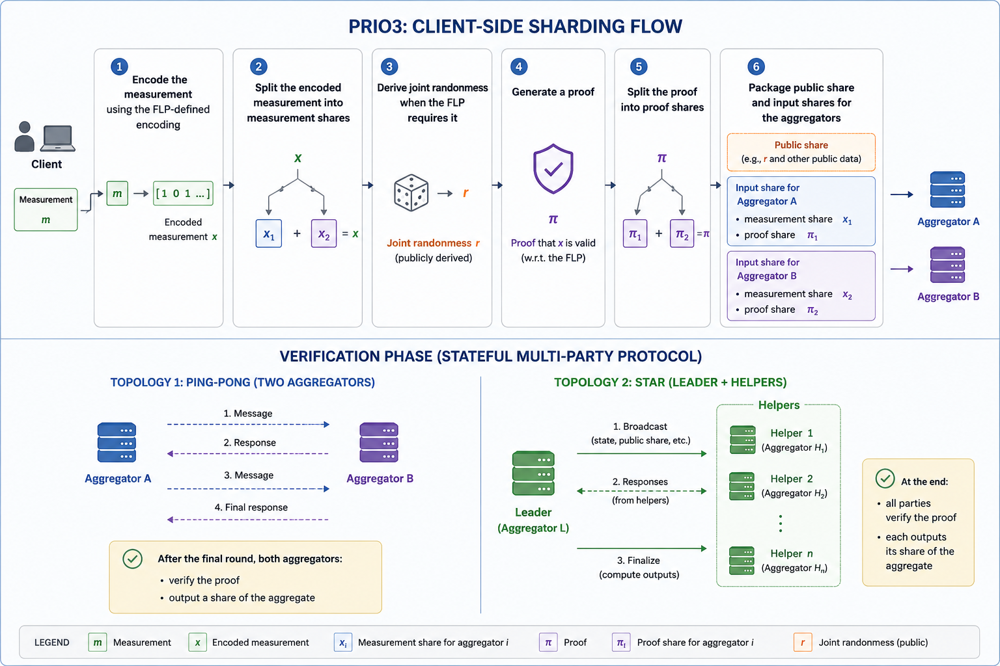

# Prio3 VDAF Versus A BGV-FHE Approach

## Purpose

This document compares:

- **Prio3 as specified** in `draft-irtf-cfrg-vdaf-19`
- a **possible BGV-based FHE reinterpretation**

## What Is Prio3

In the VDAF draft, Prio3 is not just encrypted summation. It is a full verifiable distributed aggregation protocol built around:

- client-side **sharding** of a measurement into aggregator input shares
- a **public share**
- one or more rounds of **verification**
- **verifier shares** and, when needed, **verifier messages**
- aggregator-local production of **output shares**
- final **unsharding** into the aggregate result

At the generic VDAF level, the draft defines:

- sharding
- verification
- aggregation
- unsharding

For Prio3, the client-side sharding flow is as follows:

1. encode the measurement using the FLP-defined encoding
2. split the encoded measurement into measurement shares
3. derive joint randomness when the FLP requires it
4. generate a proof
5. split the proof into proof shares
6. package public share and input shares for the aggregators

The verification phase then runs as a stateful multi-party protocol. Depending on the topology:

- two aggregators can use the **ping-pong** pattern
- more aggregators can use the **star** pattern with a Leader and Helpers

## Comparison Table

| Prio3 component | Role in the spec | Possible BGV analogue | Port status | Why |
| --- | --- | --- | --- | --- |
| Measurement encoding | Encode the client measurement into FLP-compatible field elements | Encode the measurement into SIMD plaintext slots before encryption | Portable with redesign | The measurement can still be represented for hidden aggregation, with the main change being a different encoding layout adapted to the BGV plaintext space |
| Measurement sharding | Split encoded measurement into shares across aggregators | Either encrypt the whole measurement once, or split the measurement into multiple encrypted shards | Portable with redesign | This can be handled as a straightforward packaging change: shard before encryption, or replace additive shares with encrypted shards or a threshold-encryption input |
| Public share | Carries protocol-visible data needed by all aggregators | Protocol metadata, ciphertext routing info, or public parameters | Portable with redesign | The common public report data can still exist, but its concrete contents must be repackaged around ciphertext-handling rather than Prio3 share encodings |
| Joint randomness | Prevent client tampering while keeping proof generation sound | External joint-challenge or shared-randomness protocol among aggregators | Not portable | This is more than a format change: the aggregators need a new coordination protocol to derive and validate common randomness, because BGV does not provide the Prio3 joint-randomness mechanism or its soundness conditions by simple re-encoding |
| FLP proof generation | Produce proof shares for encoded validity | Client computes the Prio3 FLP proof on plaintext, then encrypts, encapsulates, or otherwise protects the resulting proof shares | Portable with redesign | Proof generation is already client-side in Prio3, so keeping the same proof logic and only changing how proof shares are packaged or protected is a schema-level change |
| Verifier share | Per-aggregator contribution to interactive verification | Encrypted or otherwise protected per-aggregator verification contribution | Not portable | This is not just a wrapper change: Prio3 verifier shares are defined as outputs of the FLP query and combine according to Prio3 verification semantics, so reproducing them under BGV requires redesigning the verification layer, not merely re-encoding an existing object |
| Verifier message | Inter-round verification message, e.g. joint randomness seed | Reconstructed challenge, seed, transcript value, or other combined verification message | Not portable | A BGV-based system can have inter-round messages, but obtaining their role requires a new message-derivation protocol rather than a simple schema substitution for the Prio3 verifier-message object |
| Verification rounds | Interactive transition system yielding output shares or rejection | Multi-round verification or coordination protocol layered on top of ciphertext processing | Not portable | The round structure can be rebuilt, but only by designing a new state machine around ciphertext processing and coordination; that is more than changing how existing Prio3 objects are encoded |
| Aggregation parameter validity | Decide whether aggregation parameters are valid for the VDAF instance | Validate BGV context and protocol parameters before execution | Portable with redesign | The pre-execution validity check survives with mostly changed parameter contents rather than changed protocol logic |
| Aggregation | Combine valid contributions into aggregate shares | Homomorphically add valid ciphertexts or ciphertext shards | Portable with redesign | This is still the same accumulation step, with the main difference being that the aggregated artifact is a ciphertext or encrypted shard instead of a Prio3 field vector |
| Unsharding | Recover the aggregate result from output shares | Decrypt final ciphertext or combine encrypted shares before decryption | Portable with redesign | Final recovery still happens at the end of aggregation, with the main change being the representation of the aggregate before release |
| Message serialization | Standardized field/seed/share encodings | Scheme-specific serialization of ciphertexts, keys, parameters, commitments, and protocol messages | Not portable | This requires a different wire-object family altogether, not just a light repackaging of the same Prio3 serialized structures |

## What Doesn't Port

Prio3 is a protocol over visible shares and verifier messages.
BGV gives encrypted ciphertexts.
That is why a direct port does not work.

### 1. FLP proof generation does not become a BGV mechanism

The client can still build the proof in plaintext and then encrypt it.
But then the proof system is still Prio3.
BGV is only wrapping it, not replacing it.

### 2. Verifier shares and verifier messages are not produced by BGV "for free"

In Prio3, aggregators exchange small visible values.
In BGV, the values are hidden inside ciphertexts.

So problems appear immediately:

- you cannot directly read the verifier value
- ciphertexts may be packed differently
- you may need decryption before the next round
- extra FHE operations may be needed just to align data

So this is not a simple format change. It needs a new verification procedure.

### 3. Joint randomness is tied to the proof flow

Prio3 joint randomness is part of the proof logic.
It is not just extra random bytes.

BGV can add a new randomness protocol.
But that is already a redesign.
It must be tied correctly to the ciphertexts and proof checks.

### 4. Failure handling changes shape

Prio3 can reject a bad report directly.
With BGV, the common pattern is to compute an encrypted validity flag and mask the input.

The missing branch is the key problem:

- under FHE, you cannot simply do `if proof_ok == 1 then accept else reject` on a hidden result and have all parties learn the branch outcome for free
- the check result is inside a ciphertext
- to branch on it in the normal protocol sense, someone must decrypt it or the protocol must be redesigned around encrypted masking instead of visible rejection

The same problem appears if proof checking is done under FHE:

- the proof-check result is encrypted too
- aggregators do not directly know whether the proof passed
- to learn the answer, they need decryption, threshold decryption, or a masking-based redesign

That changes behavior:

- bad inputs may still cost a lot to process
- the result may stay hidden
- masking is not the same as rejection

### 5. The security argument has to be redone

Even if the system looks similar from the outside, the inside changes:

- shares become ciphertexts
- verification changes
- decryption rules matter
- failure handling changes

So the original Prio3 security reasoning does not automatically carry over.
